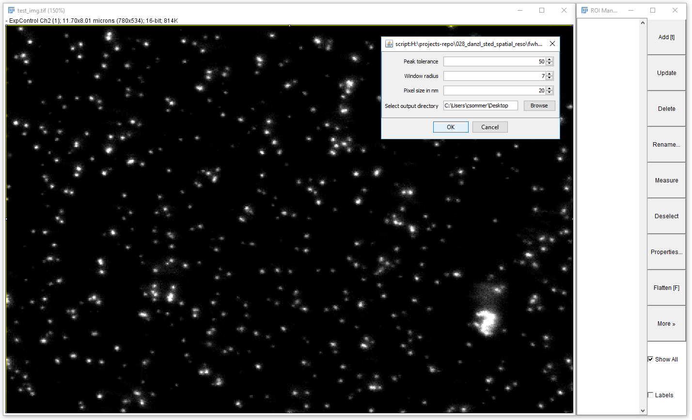
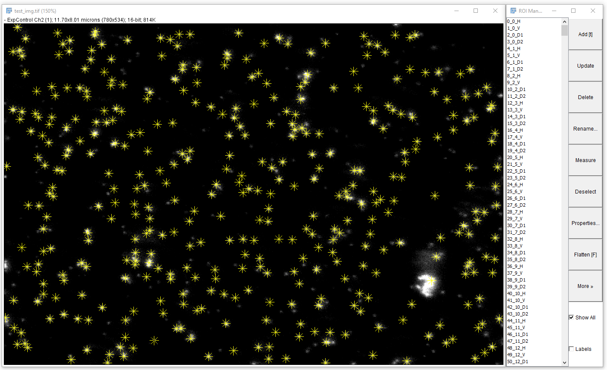

# fwhm_on_spots
## Full-width-half-maximum of 2D spots
This jython-fiji macro computes the FWHM on bright spots on dark background by, 
first, finding all maxima in an image (using fiji `Find Maxima`) and second, iterating 
over all 2D peak locations. For each peak the horizontal, vertical and two diagonal line intensity 
profiles are extracted and a general Gaussian function is fit. From that the standard
deviation and goodness-of-fit is extracted. The standard deviation is converted 
to FWHM.

Peak locations, FWHM, goodness-of-fit and other read-outs are exported to an tab-delimited, excel
readable file. In additions, all (fiji-)Rois of the according line profiles are 
exported into a fiji RoiManager zip-file.

### Input
1. Image: A gray-valued image (already opened in fiji)
2. Peak tolerance: Height of the peak above background (see fiji `Find Maxima`)
3. Window radius for Gaussian fit in pixel
4. Pixel size in nano-meters (for export)
5. Output directory (for export)

### Output
1. `fwhm_values.txt`: Columns are:
    * id: index
    * peak_id: number of peak
    * x_pos, y_pos: the x and y position in image
    * type: horizontal (H), vertical (V), diagonal 1 (D1), diagonal 2 (D2)
    * fwhm: full width half maximum of Gaussian fit
    * fwhm_nm: FWHM scaled by pixel size
    * r2_GoF: goodness of fit. Good values for a fit should be > 0.9
    * avg_fwhm: average of all fwhm of the four types (H, V, D1, D2) per peak_id
    * area_profile: area under the profile
    * area_gauss: area under the Gaussian fit 
    
2. `fwhm_fiji_rois.zip`: Fiji-Rois with horizontal, vertical and diagonal line profiles named as "\<index>\_\<peak_id\>\_\<type\>"

### Example

